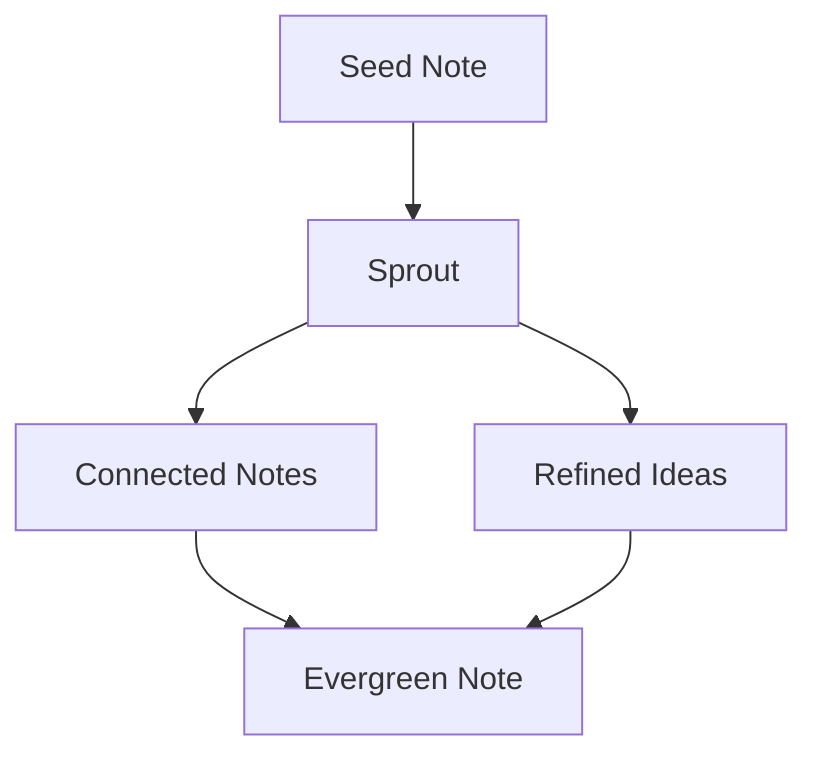

# Building a Digital Garden

A digital garden is more than just a blog—it's a space where ideas grow and evolve over time. Unlike traditional blogs that follow a chronological format, digital gardens are structured more like wikis or interconnected notebooks.

## The Core Principles

1. **Non-linear Growth**: Ideas don't have to be perfectly formed before being planted
2. **Interconnectedness**: Everything is connected, just like in nature
3. **Continuous Evolution**: Pages grow and change over time

## Technical Implementation

```typescript
interface GardenNode {
  id: string;
  type: "seed" | "sprout" | "evergreen";
  content: string;
  connections: string[];
  lastTended: Date;
}
```

The above represents a basic node in our digital garden. Each piece of content starts as a seed, develops into a sprout, and may eventually become an evergreen note.

## System Design

The garden is built with several key components:

- **Content Layer**: MDX for rich content
- **Graph Layer**: Tracks connections between nodes
- **Visual Layer**: Reveals the underlying system

When we understand content as a living system, we can build tools that support natural growth patterns rather than forcing artificial structures.

### Example Growth Pattern



## Progressive Enhancement

The garden reveals its systematic nature through progressive enhancement:

1. First visit shows clean, minimal content
2. System visualization fades in to show connections
3. Interactive elements become available
4. Deep system integration reveals knowledge patterns

More to come as this garden grows...
